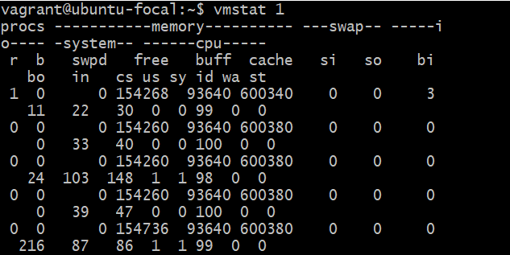
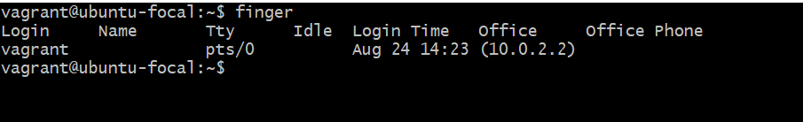
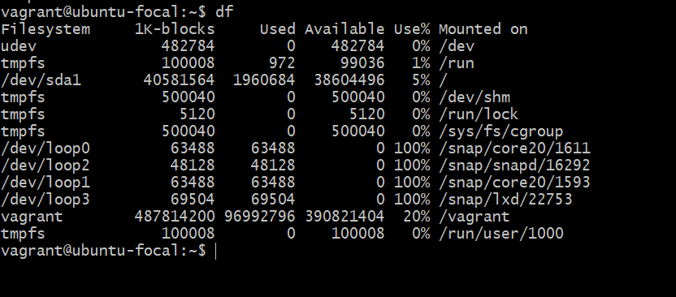

# 10 Linux commands and what they are used for :   
# <code>vmstat1</code>: its used to Display virtual memory statistics 
#  
# <code>ip a</code>: It displays all network interface and ip address 
# 
# <code>dig domain</code>:  Display DNS information for domain. 
#  
# <code>ping host</code>: Its used to send ICMP echo request to host. 
# 
# <code>du -ah</code>: Display disk usage for all files and directories in human readable format.
# 
# <code>apt install</code>: Its used to install and update packages 
# 
# <code>finger</code>: It shows information of all the users logged in.
# 
# <code>last reboot</code>: Show system reboot history
# 
# <code>free -h</code>: Display free and used memory 
# 
# <code>df</code>: Gives free hard disk space on your system 
# 