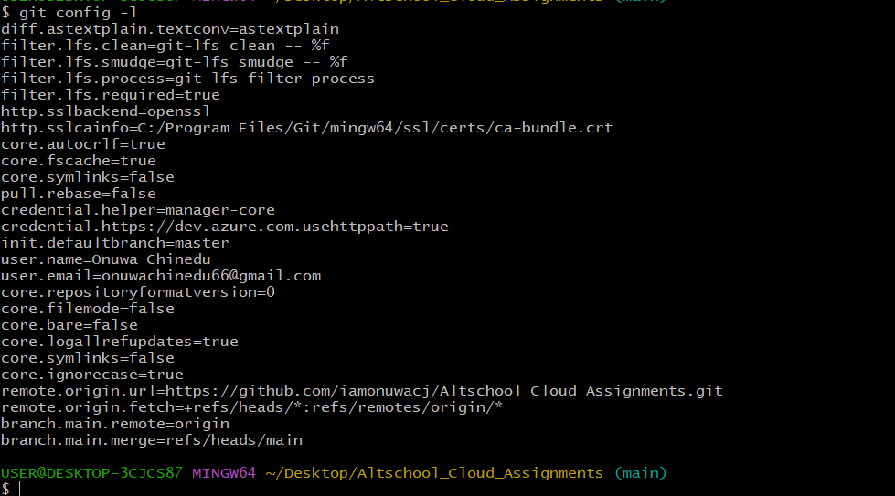
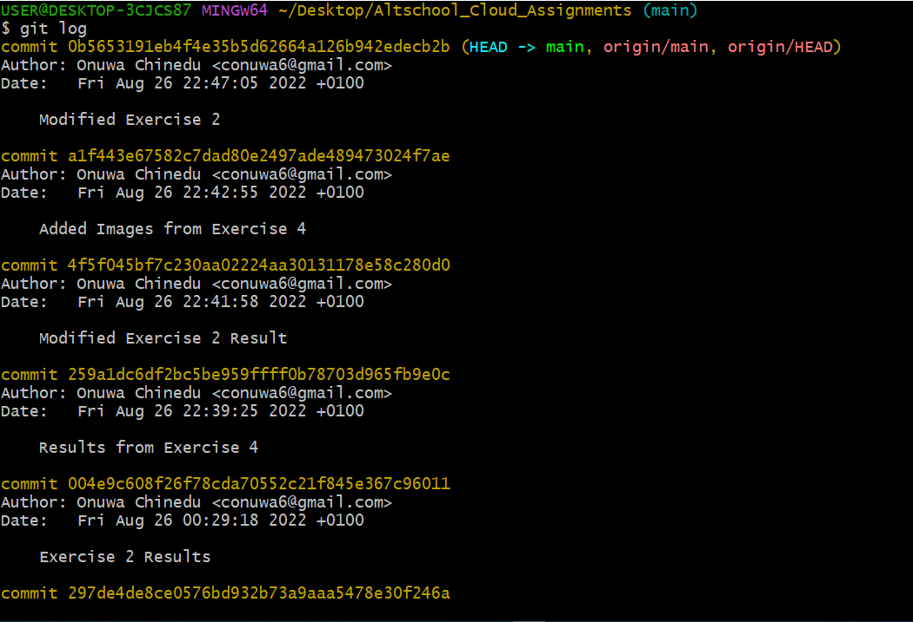

# This is the results gotten from exercise 5
<ul>
    <li>Contents of <code> git config -l </code>
    
    </li>
    <li>Contents of <code> git remote -v </code>
    
    </li>
    <li>Contents of <code> git log </code>
    
    </li>