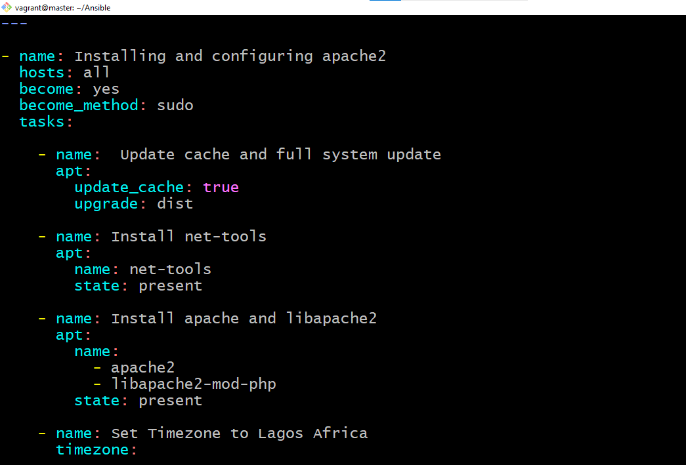
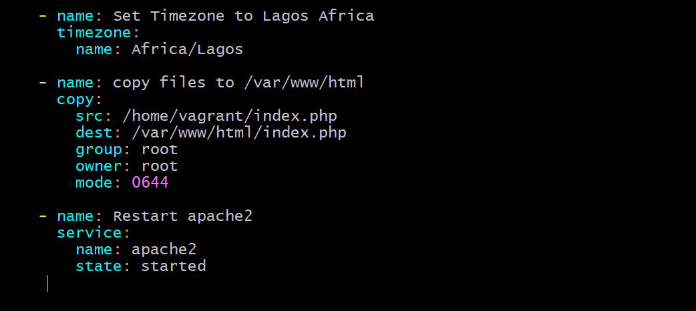
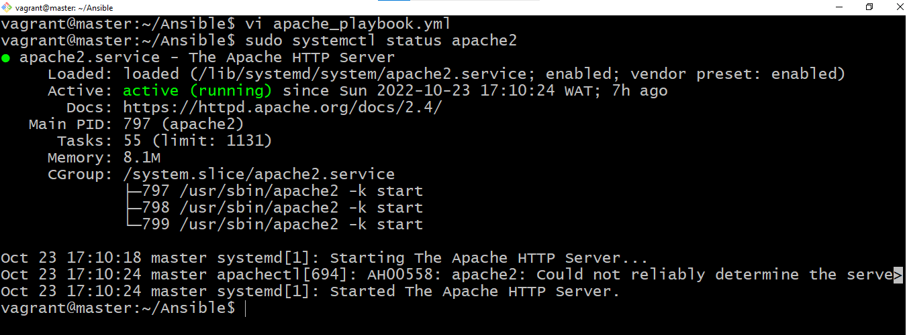
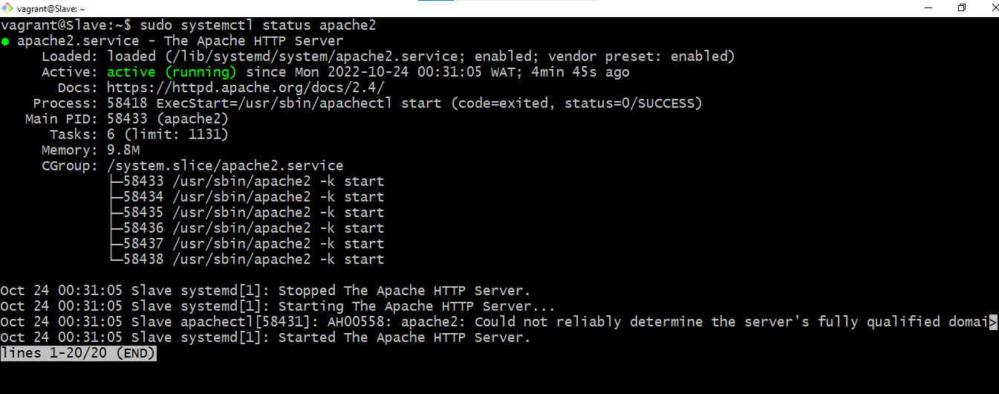
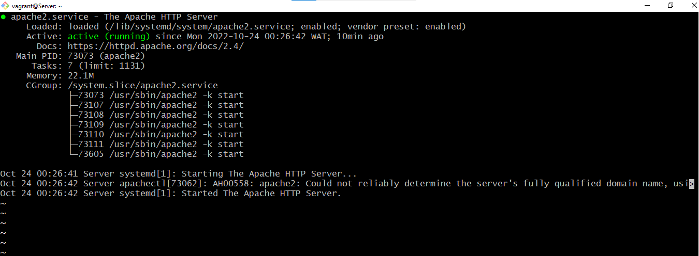
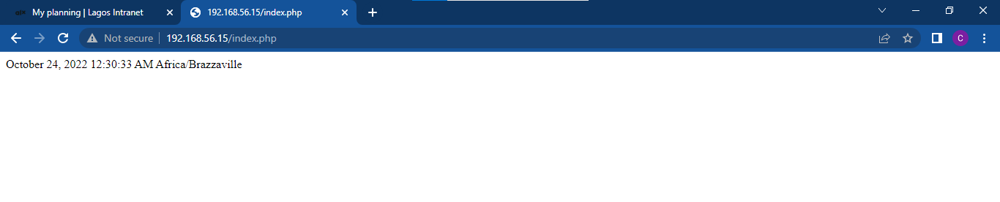

## This file contains the results gotten from Month 2 Week 4 Exercise.

## This is my ansible play book

  

## This is the output of <code> sytemctl status apache2</code> for all my servers
<ul>
<li></li>
<li></li>
<li></li>
</ul>

## This is the rendered page 
